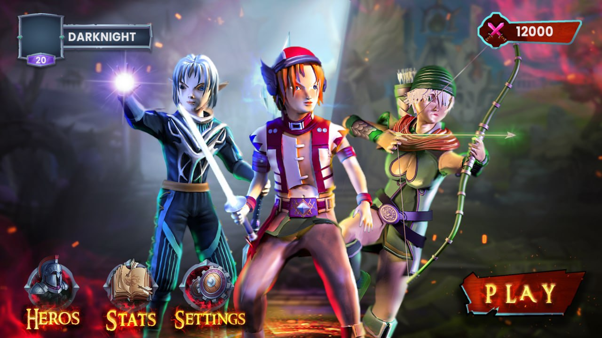
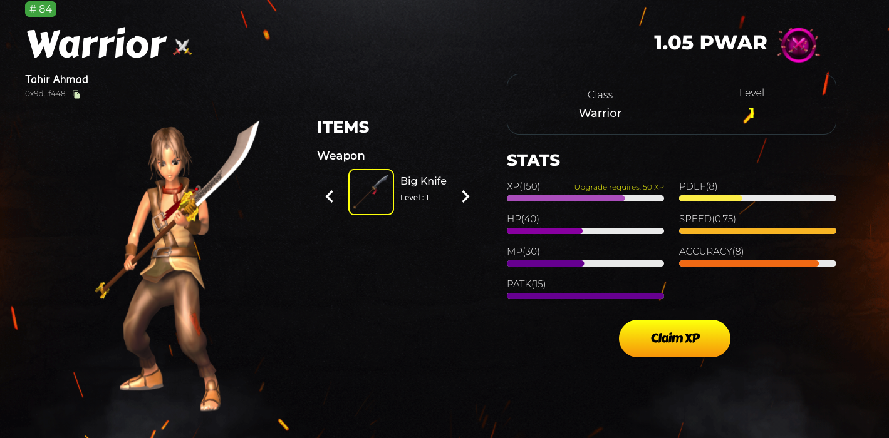

# Ancient Hero

The game industry is changing rapidly as new technologies like cryptocurrencies and AR/VR are developed, it is important to understand how these technologies and existing game markets work.

Ancient Hero is an innovative Web3 PvP strategy game set in a mythical world, where players collect, trade, and battle unique characters and assets represented as NFTs on the Harmony blockchain. The game aims to provide players with true ownership of their in-game assets, foster a competitive community through alliances and battles, and educate users about blockchain technology and NFTs.

With a very cool user interface and a well thought out game play, Ancient Hero promises to be an exciting game which you can play with friends and family.

You can find the circuits, contracts and backend here [here](https://github.com/Destiny-01/mythicals/tree/backend)

Stack

```
Frontend - React
Core Backend - Solidity 
Snarkjs Prover - Nodejs
```





